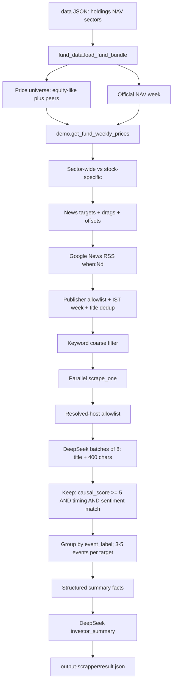

# Weekly fund insight pipeline — architecture and data flow

This document describes **what the live code does today** when you run `python main.py`. It is not a research plan. Entry point: [`main.py`](main.py). Output: [`output-scrapper/result.json`](output-scrapper/result.json).

Secrets live in `.env` (`DEEPSEEK_API_KEY`). They are never written to git.

---

## 1. Purpose

Explain **why this Indian mutual-fund NAV moved over one official NAV week**, using:

- Real holdings / NAV / sectors from `data/*.json`
- NSE (and some BSE) prices from Yahoo Finance
- Google News RSS from a publisher allowlist
- Publisher-page scrapes
- DeepSeek V4 Flash (`deepseek-flash`) for causal news scoring and a short investor summary

The pipeline does **not** use a factor graph. It does **not** send cash, CDs, CPs, or overseas names through Yahoo ticker search.

---

## 2. End-to-end architecture



| Stage | Module | LLM? |
|---|---|---|
| Load JSON, official week | [`fund_data.py`](fund_data.py) | No |
| Tickers + weekly prices | [`demo.py`](demo.py) | No |
| Who gets news | [`stocks_for_news.py`](stocks_for_news.py) | No |
| RSS harvest | [`app.py`](app.py) | No |
| Page fetch + extract | [`web_scrapper.py`](web_scrapper.py), [`lib/`](lib/) | No |
| Causal scores | [`news_relevancy_agent.py`](news_relevancy_agent.py) | Yes — DeepSeek |
| Event grouping | [`stocks_for_news.py`](stocks_for_news.py) | No (uses LLM `event_label`) |
| Investor summary | [`news_relevancy_agent.py`](news_relevancy_agent.py) | Yes — DeepSeek |
| Orchestration | [`main.py`](main.py) | — |

---

## 3. Inputs

### 3.1 Holdings — `data/fund_holding_data.json`

Array of positions. Typical fields:

```json
{
  "instrument_name": "HDFC Bank Limited",
  "percentage": 7.63,
  "industry": "Banks",
  "asset_type": "Domestic Equities"
}
```

Mapped immediately to pipeline rows:

| JSON field | Pipeline field |
|---|---|
| `instrument_name` | `name` |
| `industry` | `detail` and `industry` |
| `percentage` | float weight (not `"9.31%"`) |
| `asset_type` | kept for filters |

**Equity-like universe:** `asset_type` in `{Domestic Equities, REITs & InvITs}`.

Cash, CDs, CPs, T-bills, overseas equities, MF units are **not** priced and **not** sent to news.

### 3.2 NAV — `data/fund_nav_history.json`

```json
{ "nav_date": "2026-09-11", "nav_value": 89.5712 }
```

Newest date = week **end**. Week **start** = NAV on or closest-before (end − 7 calendar days).

Example currently in the dump:

- Start `2026-09-04` NAV `90.5289`
- End `2026-09-11` NAV `89.5712`
- Official change `(end − start) / start × 100` → **−1.058%**

News dates are **calendar days in IST**. Price sessions skip weekends; news does not.

### 3.3 Sectors — `data/fund_sector.json`

`{ "sector", "percentage" }`. Sectors with weight **≥ 3%** get a classification slot. Names containing `##` are treated as overseas: allocation table only, no Indian RSS.

---

## 4. Step-by-step data transformation

### Step A — Load (`fund_data.load_fund_bundle`)

Produces:

- `official_nav`: `{start, end, start_nav, end_nav, change_pct}`
- `price_rows`: Domestic Equities + REITs with weight **≥ 2%** (headline names)
- `price_universe`: those names **plus** smaller peers that sit in a **≥ 3%** domestic sector (so Pharma / Realty / FMCG can be classified as sector-wide vs mixed)
- `large_sectors`: sectors ≥ 3%

**Transform:** raw fund JSON → typed week + two holding lists.

---

### Step B — Prices (`demo.get_fund_weekly_prices`)

For each name in `price_universe`:

1. **Ticker (dynamic, not a hardcoded map)**  
   Yahoo search. Prefer a clean `.NS` quote, then `.BO`. Skip hyphen series such as `-RR` / `-BL`. Retry without `Limited` / `Ltd` if search is empty.

2. **Weekly bars**  
   Closes whose session dates fall in `[week_start, week_end]`.

3. **Weekly % change**

```
weekly_change_pct = (last_close − first_close) / first_close × 100
```

4. **NAV impact of that line**

```
weekly_nav_impact_pct = nav_weight × weekly_change_pct / 100
```

rounded to 3 decimals.

Failed ticker or missing prices → `skipped` (dropped from averages).

**Headline set** = priced names with weight ≥ 2%.  
**Price-only** = smaller peers used only for sector classification.

Approx equity impact = sum of `weekly_nav_impact_pct` on headline names (compare to official NAV; they will not match exactly).

**Transform:** company names → `{ticker, weekly_change_pct, daily_changes[], weekly_nav_impact_pct}`.

---

### Step C — Who gets news (`stocks_for_news`)

#### Sector-wide vs stock-specific

For each ≥ 3% domestic sector, take priced members in that industry:

| Scope | Rule |
|---|---|
| `sector_wide` | 2+ priced names, **same sign**, spread (max − min) **< 1.5%** |
| `mixed` | 2+ names that disagree or spread is wide |
| `single` | 0 or 1 priced name |

**News targets**

1. If an industry is `sector_wide`, **one sector target** (not a separate RSS query per bank/IT name in that bucket).
2. Every other ≥ 2% name gets a **stock** target.
3. A ≥ 3% sector with no ≥ 2% name (e.g. Pharma) still gets a **sector** target.

**`target_sentiment`** comes from **that name’s weekly price sign**, not from fund NAV:

- weekly change < 0 → `"negative"`
- weekly change > 0 → `"positive"`

**Drags** = headline names whose impact is in the **same direction** as official NAV.  
**Offsets** = headline names whose impact **cushions** NAV (e.g. Coal India up while NAV is down).

Offsets still get **positive** news even when the fund is down.

**Transform:** priced holdings → list of news targets `{type, name, industry, scope, target_sentiment, weekly_change_pct, ...}`.

---

### Step D — Collect news (`app.fetch_news_for_week`)

No LLM here.

#### Queries

Stock target:

- `"{instrument_name}"`
- `"Indian {industry}"`

Sector target:

- `"Indian {sector}"`
- `"{sector} sector India"`

Google News RSS URL uses `when:{N}d`. `N` is chosen so the window **reaches week start from today** (often 12–13 days, not a naive 7).

#### Filters, in order

| Filter | What happens |
|---|---|
| Parse RSS | title, description, Google News `link`, `source`, published time |
| IST calendar | keep if `week_start ≤ pub_date ≤ week_end` |
| Publisher allowlist (RSS `source`) | Business Standard, LiveMint/Mint, Economic Times, Moneycontrol, NDTV Profit, Bloomberg |
| Title dedup | exact title, then fuzzy word overlap |
| Empty `source` | **kept** until scrape resolves a host |

Article object after RSS:

```json
{
  "article_id": 1,
  "title": "...",
  "description": "...",
  "link": "https://news.google.com/...",
  "source": "Moneycontrol",
  "published": "...",
  "date": "2026-09-08",
  "news_type": "instrument"
}
```

There is **no 10-articles-per-day cap**.

---

### Step E — Keyword coarse filter (`stocks_for_news.filter_articles_by_keyword`)

Generous **keep** if the **title** has any of:

- a significant token from the company name (skip `ltd` / `limited`)
- the industry string
- a financial keyword (earnings, RBI, rating, strike, REIT, …)
- a figure marker (`₹`, `Rs`, `crore`, `%`, …)

This only drops obvious non-market titles. False positives are expected; DeepSeek is the real filter.

**Transform:** allowlisted RSS list → `keyword_count` list on that target.

---

### Step F — Scrape (`main.scrape_unique_articles` → `web_scrapper.scrape_one`)

Unique URLs across **all** targets are scraped once (bank queries overlap). Default **8 workers**.

For each Google News URL:

1. Resolve publisher URL (`lib/google_news.py`)
2. Fetch HTML with TLS impersonation (`lib/fetch.py`, `curl_cffi`)
3. Extract text (`lib/extract.py`: trafilatura, BeautifulSoup fallback if text is thin)
4. If resolved host is **not** on the allowlist (`livemint.com`, `moneycontrol.com`, `ndtv.com` path with `profit`, etc.) → status `publisher_blocked`, text cleared
5. Successful extracts dumped under gitignored `out/{index}_{slug}.json|.html`
6. Cache: if `out/` already has that `input_url`, reuse it

Attached onto every copy of the article:

- `resolved_url`, `text` (full extract in memory), `scrape_status`

Only `scrape_status` in `{ok, extract_thin}` with non-empty text goes to the LLM.

**Transform:** Google News links → publisher URL + article body.

---

### Step G — Causal LLM (`news_relevancy_agent.score_articles_causal`)

**Model:** `deepseek-flash` (DeepSeek V4 Flash / V4.1 Flash)  
**API:** `POST https://api.deepseek.com/chat/completions` via `requests`  
**Thinking:** **disabled**  
**JSON mode:** `response_format: json_object`

#### Batching

- `CAUSAL_BATCH_SIZE = 8` articles per call **inside one news target**
- Not one call per article, not one giant call for the whole fund
- Example: 23 HDFC scrapes → 3 DeepSeek calls

#### What the model sees (not the full article)

For each article: **title + first 400 characters** of extracted text.

Plus a **price header** for that target:

- name, type, industry, ticker
- weekly % change
- `TARGET_SENTIMENT` (`positive` / `negative`)
- official fund NAV %
- week dates
- daily % bars

#### System prompt (causal)

The model is told:

- Score **cause of the observed weekly move**, not “is this about the ticker”
- If `TARGET_SENTIMENT` is negative, bullish beat/upgrade stories get **low `causal_score`**
- Same real-world story → same `event_label` (3–8 words)
- Return JSON `{"scores": [ ... ]}`

Fields per article:

| Field | Meaning |
|---|---|
| `relevancy_score` 0–10 | About this company/sector? |
| `causal_score` 0–10 | Caused **this week’s direction**? |
| `event_label` | Underlying event tag |
| `causal_link` | `direct` / `sector` / `macro` / `none` |
| `timing_plausible` | Published on/before the move |
| `sentiment` | Direction **this story** implies |
| `reasoning` | 1–2 sentences |

#### User prompt shape

```
Return json scores for every article below.

TARGET: HDFC Bank Limited
TYPE: stock
...
WEEKLY CHANGE: -2.1%
TARGET_SENTIMENT: negative
...
--- Article 1 (published: ...) ---
Title: ...
Text (first 400 characters): ...
```

Instruction at the end: do not give `causal_score >= 5` to bullish stories when sentiment is negative (and the reverse).

**Transform:** scraped articles → scored articles with those seven fields.

---

### Step H — Keep, group, cap (`main.apply_causal_scores`)

Code, not LLM.

**Keep** an article only if **all** are true:

1. `causal_score >= 5`
2. `timing_plausible` is true
3. `sentiment == target_sentiment`

Example: stock down + “profit beats estimates” → usually dropped (positive sentiment and/or low causal).

**Group** survivors by `event_label` (case-insensitive; similar labels with ≥ 60% word overlap merge).

**Pick** the best article per group (highest `causal_score`, then longer text).

**Cap** at **3–5 events** per news target (`MAX_EVENTS_PER_TARGET = 5`).

Each event written to `relevant_news` includes rank, label, title, source, link, scores, reasoning, and **`text` truncated to 400 characters**. Full HTML stays only in `out/`.

Raw `articles` on the target are **deleted** before JSON write so `result.json` stays smaller.

**Transform:** scored pile → 0–5 events per target.

---

### Step I — Investor summary (`write_investor_summary`)

Second DeepSeek call (still thinking **off**, JSON mode).

**Input facts only** (no article bodies):

- week dates, official NAV start/end/%
- `approx_equity_impact_pct`
- top 3 **drags** (name, weekly change, NAV impact)
- top 3 **offsets**
- sector-wide labels
- one line per target that has events: `event_label` + short `event_summary`

**System prompt (summary)**

- Return `{"investor_summary": "..."}`
- 4–6 sentences, **at most 120 words**
- Cover NAV, drags, offsets, strongest events
- Do not list URLs or every holding
- Do not invent numbers
- If news is thin, say the move looks like price/flow

If the model exceeds ~140 words, code trims.

**Transform:** structured facts → one paragraph on `investor_summary`.

---

## 5. Outputs

### 5.1 `output-scrapper/result.json`

Top-level keys include:

| Key | Content |
|---|---|
| `week` / `official_nav` | Analysis window and official NAV move |
| `approx_equity_impact_pct` | Sum of headline holding impacts |
| `investor_summary` | Phase 5 paragraph |
| `holdings` | ≥ 2% priced names with weekly stats |
| `price_only` | Smaller peers priced only for classification |
| `skipped` | Ticker/price failures |
| `sector_moves` | Scope, spread, members |
| `stock_moves` / `news_targets` | Targets + `relevant_news[]` |
| `drags` / `offsets` | Same-direction vs cushion names |

Stdout prints a **compact** JSON (counts + `investor_summary` + path), not every article.

### 5.2 `out/`

Per-article scrape dumps (gitignored). Used as a scrape cache on reruns.

---

## 6. Funnel (typical week on this fund)

These are orders of magnitude, not hard caps except the last row.

| Stage | Typical size | Mechanism |
|---|---|---|
| Raw RSS (2 queries × ~17 targets) | hundreds–thousands | Google feed |
| In-week + allowlist + dedup | ~80–250 | Publishers + dates |
| After keyword | slightly fewer | Title heuristics |
| Successful scrapes (unique URLs) | ~80–100 | Resolve + extract |
| Sent to DeepSeek | those scrapes, **8 per call**, **400 chars** | Batches |
| After keep rule | fewer | causal + timing + sentiment |
| Attached events | **3–5 per target** | Grouping |
| Fund summary | **1 paragraph** | Second LLM |

---

## 7. What is intentionally not in this pipeline

- Factor-graph / [`direct_indirect_relationship.md`](direct_indirect_relationship.md)
- Hardcoded company → ticker dictionary
- A second HTTP stack (RSS uses `requests`; pages use `curl_cffi`)
- Scraping non-allowlisted publishers
- Sending the full article into `result.json` or into the summary LLM
- Groq for the weekly path (legacy title scorer in [`news_relevancy_agent.py`](news_relevancy_agent.py) is unused by `main.py`)

---

## 8. How to run

```
pip install -r requirements.txt
```

`.env`:

```
DEEPSEEK_API_KEY=...
DEEPSEEK_MODEL=deepseek-flash
DEEPSEEK_BASE_URL=https://api.deepseek.com
```

```
python main.py
```

A full run (RSS + scrape + scoring + summary, thinking off) is typically **about 2–3 minutes**, dominated by Google News and publisher fetches, not by the summary call.
