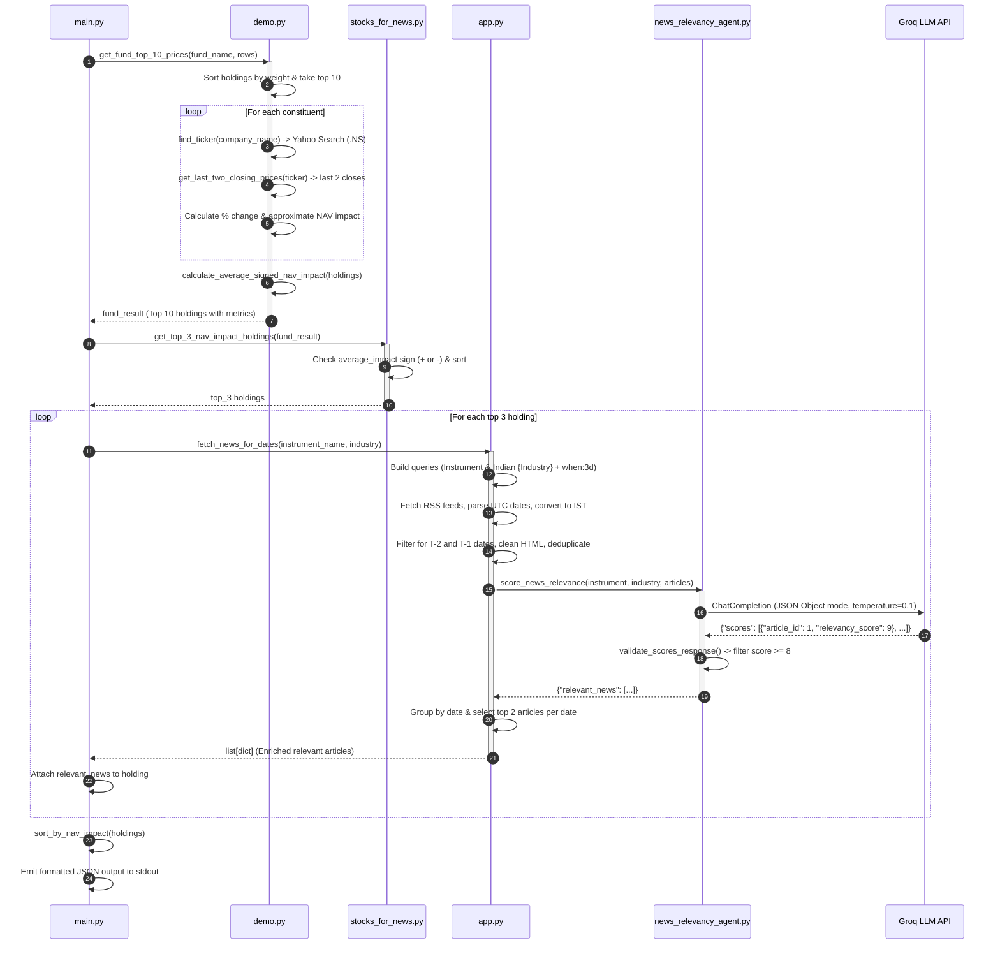
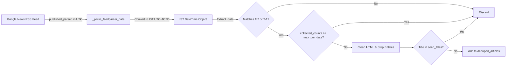

# Portfolio Intelligence & News Relevance Analysis System

A comprehensive technical reference, architectural guide, and operational documentation for the **Portfolio Intelligence & News Relevance Analysis System**.

---

## 1. Executive Summary & System Overview

The **Portfolio Intelligence & News Relevance Analysis System** is an automated financial analytics and intelligence pipeline tailored for Indian mutual funds and equity portfolios. 

Given raw fund portfolio constituent data (company names, sector/industry classifications, and percentage weights), the system:
1. Dynamically resolves real-time National Stock Exchange of India (**NSE**) ticker symbols via Yahoo Finance search queries without hardcoded mapping dictionaries.
2. Extracts recent trading session closing prices using historical market data, automatically adjusting for market holidays and weekends.
3. Computes each holding's price change, approximate contribution to the fund's Net Asset Value (**NAV Impact**), and the portfolio's overall directional trend (**Average Signed NAV Impact**).
4. Isolates the **Top 3 directional movers** (the strongest drivers during positive sessions or the greatest drags during negative sessions).
5. Harvests real-time Google News RSS feeds for both the specific company instrument and its broader industry sector, localized to India and filtered strictly to recent target dates in Indian Standard Time (**IST**).
6. Evaluates news relevance using a specialized **Groq LLM Relevance Agent** (`openai/gpt-oss-120b` or custom configured model) with a strict financial materiality rubric (scoring 0–10).
7. Validates and filters articles, preserving high-impact catalysts ($\ge 8$ score), selecting the top 2 articles per date, and emitting a clean, sorted JSON payload.

---

## 2. High-Level System Architecture

```mermaid
flowchart TD
    subgraph Ingestion_and_Math["1. Market Data & NAV Engine (demo.py & stocks_for_news.py)"]
        A[Fund Portfolio Data\nName, Industry, % Weight] --> B[get_top_10_holdings\nSort by NAV % descending]
        B --> C[find_ticker\nYahoo Search .NS Suffix]
        C --> D[get_last_two_closing_prices\nTicker.history 10d -> last 2 closes]
        D --> E[calculate_approx_nav_impact\nWeight * Change % / 100]
        E --> F[calculate_average_signed_nav_impact\nMean of top 10 impacts]
        F --> G[get_top_3_nav_impact_holdings\nFilter by Directional Trend]
    end

    subgraph News_Harvesting["2. News Harvesting & IST Engine (app.py)"]
        G --> H[fetch_news_for_dates\nmax_per_date=3, top_per_date=2]
        H --> I[Build RSS URLs\nInstrument & Indian + Industry + when:3d]
        I --> J[Fetch Google News RSS\nfeedparser parse]
        J --> K[Date Conversion & IST Normalization\nUTC struct_time -> IST datetime]
        K --> L[Target Date Filtering\nT-2 and T-1 days in IST]
        L --> M[Sanitize Text & Deduplicate\nStrip HTML, decode entities, unique titles]
    end

    subgraph LLM_Scoring["3. Relevance Scoring Agent (news_relevancy_agent.py)"]
        M --> N[score_news_relevance\nBuild prompt with instrument, industry, articles]
        N --> O[Groq LLM API\nopenai/gpt-oss-120b\ntemp=0.1, JSON Mode]
        O --> P[validate_scores_response\nValidate IDs, ranges 0-10, remove hallucinations]
        P --> Q[Filter Relevancy >= 8\nSort by score descending]
    end

    subgraph Aggregation_and_Output["4. Orchestration & Output (main.py)"]
        Q --> R[Pick Top 2 Articles per Date\nT-2 and T-1]
        R --> S[Attach to Holding Object]
        S --> T[sort_by_nav_impact\nNegatives asc | Positives desc]
        T --> U[Final Structured JSON Output]
    end
```

---

## 3. End-to-End Pipeline Execution Flow



---

## 4. Mathematical & Financial Formulations

### 4.1 Stock Price Percentage Change ($\Delta P$)
For a given equity ticker, the percentage change between the two most recent valid trading days ($t-2$ and $t-1$) is calculated as:

$$\Delta P = \left( \frac{P_{t-1} - P_{t-2}}{P_{t-2}} \right) \times 100$$

*Where:*
- $P_{t-1}$ is the closing price of the most recent trading session.
- $P_{t-2}$ is the closing price of the preceding trading session.

### 4.2 Holding NAV Impact Percentage
The approximate contribution of an individual stock holding to the total portfolio NAV change is modeled as:

$$\text{NAV Impact (\%)} = \frac{W_i \times \Delta P_i}{100}$$

*Where:*
- $W_i$ is the weight of holding $i$ as a percentage of total portfolio NAV (e.g., $9.31\%$).
- $\Delta P_i$ is the percentage price change of holding $i$ (e.g., $-1.27\%$).
- $\text{NAV Impact} = 9.31 \times (-1.27) / 100 = -0.118\%$.

### 4.3 Average Signed NAV Impact ($\overline{\text{Impact}}$)
To determine the directional bias of the portfolio's top holdings:

$$\overline{\text{Impact}} = \frac{1}{N} \sum_{i=1}^{N} \text{NAV Impact}_i$$

*Where $N$ is the number of valid top holdings (typically $N=10$).*

### 4.4 Directional Holding Selection Logic
- **Negative Portfolio Bias ($\overline{\text{Impact}} < 0$):**
  Filters holdings where $\text{NAV Impact} < 0$, sorted in ascending order (most negative first, e.g., $-0.21, -0.061, -0.052$). The first 3 holdings are selected.
- **Positive Portfolio Bias ($\overline{\text{Impact}} > 0$):**
  Filters holdings where $\text{NAV Impact} > 0$, sorted in descending order (highest positive first, e.g., $+0.50, +0.30, +0.10$). The first 3 holdings are selected.
- **Neutral Portfolio Bias ($\overline{\text{Impact}} == 0$):**
  Returns an empty list (`[]`).

### 4.5 Output Sort Ordering
When presenting the final analyzed holdings, holdings are ordered such that negative contributors are sorted ascending (greatest drags first), followed by positive contributors sorted descending (greatest gainers first).

---

## 5. Detailed Component & Module Breakdown

### 5.1 `main.py` — Orchestrator & CLI Entry Point
The primary orchestration engine connecting the financial calculations with news harvesting and LLM scoring.

- **`main()`**:
  - Defines the input portfolio data (sample fund holdings with names, sector details, and percentage weights).
  - Uses `contextlib.redirect_stdout(io.StringIO())` while calling `demo.get_fund_top_10_prices` to suppress noisy intermediate logging from third-party libraries, ensuring clean JSON stdout.
  - Calls `stocks_for_news.get_top_3_nav_impact_holdings(fund_result)` to isolate top movers.
  - Calls `process_holdings(top_3)` to fetch, filter, and score news for each holding.
  - Calls `sort_by_nav_impact` on the resulting enriched list.
  - Pretty-prints the final structured JSON list to stdout.
- **`fetch_and_score_news(holding: dict) -> list[dict]`**:
  - Delegates to `app.fetch_news_for_dates` with parameters:
    - `max_per_date = 3` (limits input articles to 12 max across 2 sources $\times$ 2 dates to remain well within LLM context and rate limits).
    - `min_relevancy_score = 8`.
    - `top_per_date = 2` (retains up to 2 top articles per target date).
- **`sort_by_nav_impact(holdings: list[dict]) -> list[dict]`**:
  - Partitions holdings into negative and non-negative subsets, sorting negative ascending and positive descending.
- **`process_holdings(holdings: list[dict]) -> list[dict]`**:
  - Iterates through top holdings, executing `fetch_and_score_news` with defensive `try...except` exception handling to ensure pipeline resilience.

---

### 5.2 `demo.py` — Dynamic Ticker Discovery, Price Engine & NAV Math
Handles external financial data retrieval through `yfinance` and performs holding calculations.

- **`find_ticker(company_name: str) -> Optional[str]`**:
  - Performs runtime search via `yfinance.Search(company_name).quotes`.
  - Iterates through result quotes and selects the first symbol ending in `.NS` (National Stock Exchange of India identifier).
  - Eliminates the need for maintaining brittle static ticker lookup tables.
- **`get_last_two_closing_prices(ticker: str) -> Optional[list[dict]]`**:
  - Instantiates `yf.Ticker(ticker)` and queries `stock.history(period="10d", interval="1d", auto_adjust=False)`.
  - Drops rows with missing (`NaN`) closing values.
  - Verifies at least 2 sessions exist; takes `df.tail(2)`.
  - Strips timezone information via `.tz_localize(None)` to avoid tz-comparison bugs.
  - Returns `[{"date": "YYYY-MM-DD", "close": float}, {"date": "YYYY-MM-DD", "close": float}]`.
- **`get_top_10_holdings(rows: list[dict]) -> list[dict]`**:
  - Parses percentage strings (`"9.31%"` $\rightarrow 9.31$) and returns the 10 highest-weighted holdings.
- **`calculate_approx_nav_impact(nav_percentage: float, change_percentage: float) -> float`**:
  - Computes $\text{round}(\frac{\text{nav\_percentage} \times \text{change\_percentage}}{100}, 3)$.
- **`calculate_average_signed_nav_impact(holdings: list[dict]) -> float`**:
  - Calculates the arithmetic mean of `nav_impact_percentage` across all evaluated holdings.
- **`get_fund_top_10_prices(fund_name: str, rows: list[dict]) -> dict`**:
  - Executes the full pipeline across all top 10 holdings and returns the unified dictionary containing `top_10_holdings` and `average_signed_nav_impact`.

---

### 5.3 `stocks_for_news.py` — Directional Holding Filter
A focused module implementing directional selection logic based on the portfolio's net trend.

- **`get_top_3_nav_impact_holdings(fund_result: dict) -> list[dict]`**:
  - Inspects `average_signed_nav_impact`.
  - If negative ($< 0$): filters holdings with negative NAV impact, sorts ascending (most negative first), and returns the top 3.
  - If positive ($> 0$): filters holdings with positive NAV impact, sorts descending (most positive first), and returns the top 3.
  - If zero ($= 0$): returns an empty list.

---

### 5.4 `app.py` — Google News RSS Harvester & IST Date Engine
Fetches, cleans, normalizes, and groups financial news from Google News RSS.

- **Constants & Configuration**:
  - `BASE_URL = "https://news.google.com/rss/search"`
  - `INDUSTRY_PREFIX = "Indian"` (e.g., `"Banks"` $\rightarrow$ `"Indian Banks"`)
  - `IST = timezone(timedelta(hours=5, minutes=30))`
- **`build_news_url_with_date(query: str, days_back: int = 3) -> str`**:
  - Formats: `https://news.google.com/rss/search?q={query}+when:{days_back}d&hl=en-IN&gl=IN&ceid=IN:en`
- **`_clean_html_text(text: str) -> str`**:
  - Strips raw HTML markup via `re.sub(r"<[^>]+>", "", text)`.
  - Unescapes HTML entities via `html.unescape`.
  - Normalizes whitespace.
- **`_parse_feedparser_date(published_parsed) -> Optional[datetime]`**:
  - Converts `feedparser` UTC `struct_time` into a timezone-aware UTC `datetime`, then converts it to IST (`dt.astimezone(IST)`).
- **`_get_source_from_entry(entry) -> str`**:
  - Extracts source publisher name from `entry.source.title` or splits standard Google News title format (`"Title - Publisher"`).
- **`fetch_news_for_dates(instrument_name, industry, max_per_date=5, min_relevancy_score=8, top_per_date=2) -> list[dict]`**:
  - Calculates target dates $T-2$ and $T-1$ in IST relative to the current IST timestamp.
  - Builds dual RSS queries:
    1. Instrument search: `{instrument_name} when:3d`
    2. Industry search: `Indian {industry} when:3d`
  - Fetches and parses RSS XML via `requests` and `feedparser`.
  - Discards articles outside target dates; enforces `max_per_date` quota per news source.
  - Deduplicates articles by title.
  - Assigns unique `article_id` integers.
  - Submits batch to `news_relevancy_agent.score_news_relevance`.
  - Enriches scored articles with description, published timestamp, date, and publisher source.
  - Groups articles by date, sorts by `relevancy_score` descending (with publication time tie-breaker), and selects the top `top_per_date` articles.

---

### 5.5 `news_relevancy_agent.py` — Groq LLM Relevance Evaluator
The AI evaluation module scoring financial news articles against a rigorous relevance rubric.

- **Environment Configuration**:
  - `GROQ_API_KEY`: Loaded from `.env`.
  - `GROQ_MODEL`: Defaults to `"openai/gpt-oss-120b"`.
- **System Prompt & Rubric**:
  - Instructs the LLM to score articles independently on a 0–10 scale based purely on potential material impact on company stock performance.
  - Explicit examples of high-impact events ($8-10$) and low-impact noise ($0-4$).
  - Enforces pure JSON output with exact schema: `{"scores": [{"article_id": int, "relevancy_score": int}]}`.
- **`build_user_prompt(instrument_name: str, industry: str, articles: list[dict]) -> str`**:
  - Serializes company name, industry, and stripped article JSON array into the prompt.
- **`validate_scores_response(response_data: dict, original_articles: list[dict]) -> list[dict]`**:
  - Guardrail validation function:
    - Confirms response is a dictionary with a `"scores"` list.
    - Validates `article_id` is an integer present in the input batch.
    - Rejects duplicate `article_id`s in LLM output.
    - Validates `relevancy_score` is an integer between 0 and 10.
    - Detects and logs any missing article IDs.
- **`score_news_relevance(instrument_name, industry, articles, model=None) -> dict`**:
  - Initializes `Groq(api_key=GROQ_API_KEY)`.
  - Executes `client.chat.completions.create` with `temperature=0.1` and `response_format={"type": "json_object"}`.
  - Validates response with `validate_scores_response`.
  - Joins valid scores back to original article metadata, filters for score $\ge 8$, and sorts descending.

---

### 5.6 `web_scrapper.py` — Dynamic Headless Browser Web Scraper
A standalone Playwright utility for JavaScript-heavy dynamic web page scraping.

- **`scrape_page(url: str) -> str`**:
  - Launches headless Chromium via `sync_playwright()`.
  - Navigates to target URL with `wait_until="domcontentloaded"` and a 60-second timeout.
  - Pauses for 3000ms (`page.wait_for_timeout(3000)`) to allow dynamic client-side hydration.
  - Returns rendered HTML content (`page.content()`).

---

## 6. Data Contracts & Schemas

### 6.1 Input Portfolio Row Schema
```json
{
  "name": "HDFC Bank Ltd",
  "detail": "Financial Services",
  "percentage": "9.31%"
}
```

### 6.2 Intermediate Holding Object Schema (demo.py output)
```json
{
  "name": "HDFC Bank Ltd",
  "industry": "Financial Services",
  "nav_percentage": 9.31,
  "ticker": "HDFCBANK.NS",
  "change_percentage": -1.25,
  "nav_impact_percentage": -0.116
}
```

### 6.3 LLM Request / Response Contract
**Request Prompt Payload (User Message):**
```text
Instrument: HDFC Bank Ltd
Industry: Financial Services

Articles to score independently:
[
  {
    "title": "HDFC Bank Announces Q3 Net Profit Growth of 33%",
    "description": "HDFC Bank reported net profit of...",
    "link": "https://news.google.com/rss/articles/...",
    "source": "Livemint",
    "published": "2026-09-09T10:15:00+05:30",
    "date": "2026-09-09",
    "news_type": "instrument",
    "article_id": 1
  }
]

Score each article independently 0-10. Return JSON with "scores" array.
```

**LLM Response Schema:**
```json
{
  "scores": [
    {
      "article_id": 1,
      "relevancy_score": 9
    }
  ]
}
```

### 6.4 Final Structured Output JSON Schema
```json
[
  {
    "name": "HDFC Bank Ltd",
    "industry": "Financial Services",
    "nav_percentage": 9.31,
    "ticker": "HDFCBANK.NS",
    "change_percentage": -1.25,
    "nav_impact_percentage": -0.116,
    "relevant_news": [
      {
        "title": "HDFC Bank Reports Q3 Profit Rise on Strong Loan Growth",
        "description": "HDFC Bank net profit grew 33% year-on-year with asset quality remaining stable...",
        "link": "https://news.google.com/rss/articles/CBMi...",
        "source": "The Economic Times",
        "published": "2026-09-09T14:30:00+05:30",
        "date": "2026-09-09",
        "relevancy_score": 9
      },
      {
        "title": "RBI Approves Appointment of Key Executive at HDFC Bank",
        "description": "The Reserve Bank of India has approved the appointment of...",
        "link": "https://news.google.com/rss/articles/CBMi...",
        "source": "Business Standard",
        "published": "2026-09-08T11:00:00+05:30",
        "date": "2026-09-08",
        "relevancy_score": 8
      }
    ]
  }
]
```

---

## 7. LLM Scoring Rubric & Financial Relevance Matrix

The `news_relevancy_agent.py` applies a financial scoring rubric:

| Score | Category | Definition & Criteria | Concrete Examples |
| :---: | :--- | :--- | :--- |
| **10** | Extremely Relevant | Direct company-specific event with very high potential to materially affect stock price. | Earnings surprises, major fraud/investigation, CEO resignation, massive M&A acquisition. |
| **9** | Very Highly Relevant | Direct company-specific development with strong potential stock impact. | Major multi-year contracts, RBI/SEBI regulatory penalty, dividend hike, large buyback announcement. |
| **8** | Highly Relevant | Meaningful company-specific or major industry event that could materially affect the company. | Key executive hiring, analyst upgrade/downgrade, major sector policy shift directly impacting business model. |
| **6 – 7** | Moderately Relevant | Clear relationship to company/industry, but expected stock impact is modest, incremental, or uncertain. | Minor branch expansion, participation in industry consortium, routine product updates. |
| **5** | Neutral / Borderline | Related to company/industry but weak or ambiguous investment impact. | Generic sponsorship news, corporate CSR activity, general survey mentions. |
| **1 – 4** | Low / Irrelevant | Peripheral connection, generic macro commentary, educational articles, or competitor news with no impact. | "How to open a bank account", generic Sensex daily wrap, news on unrelated global peers. |
| **0** | Completely Irrelevant | Zero relation to the company or its operating sector. | Unrelated sports, entertainment, or irrelevant ticker noise. |

---

## 8. Timezone, Deduplication & Quota Engineering



1. **IST Timezone Alignment**:
   Indian market trading sessions operate on IST (UTC+05:30). Google News feeds publish timestamps in UTC. Converting timestamps to IST ensures that news published after market close on $T-2$ or during trading on $T-1$ are correctly attributed to the corresponding trading dates.
2. **Deterministic Date Filter**:
   Target dates are dynamically computed as:
   - $T-2 = (\text{now}_{\text{IST}} - 2\text{ days}).\text{date}()$
   - $T-1 = (\text{now}_{\text{IST}} - 1\text{ day}).\text{date}()$
3. **Quota Protection**:
   `collected_counts` prevents feed bloat by restricting ingestion to `max_per_date=3` articles per category per date. Across 2 categories (instrument + industry) and 2 dates, this guarantees at most 12 articles sent to the LLM per holding, avoiding context limit overflows and minimizing token costs.
4. **Deduplication Strategy**:
   Exact title matching across instrument and industry feeds prevents duplicate articles from being sent to the LLM.

---

## 9. Environment Setup & Execution Guide

### 9.1 Prerequisites
- Python 3.10+
- Internet access for Yahoo Finance and Google News RSS queries
- A valid Groq API Key

### 9.2 Python Dependencies
All required libraries should be installed via `pip`:

```bash
pip install requests groq langchain-groq langchain-core pydantic python-dotenv feedparser yfinance playwright
```

*Note: If using `web_scrapper.py`, install the Chromium browser binary:*
```bash
playwright install chromium
```

### 9.3 Environment Configuration (`.env`)
Create a `.env` file in the root directory:

```ini
GROQ_API_KEY=gsk_your_groq_api_key_here
GROQ_MODEL=openai/gpt-oss-120b
```

### 9.4 Running the Pipeline

**1. Execute Full End-to-End Analysis (`main.py`):**
```bash
python main.py
```
*Outputs the JSON array containing the top 3 NAV movers and their relevant scored news articles.*

**2. Run Interactive Instrument Lookup (`app.py`):**
```bash
python app.py
```
*Prompts for an instrument name, generates RSS URLs, fetches news, and scores relevance interactively.*

**3. Test Price Extraction & NAV Math (`demo.py`):**
```bash
python demo.py
```
*Calculates price changes, NAV impact, and average signed NAV impact for sample fund data.*

**4. Test Web Scraper (`web_scrapper.py`):**
```bash
python web_scrapper.py
```
*Renders and scrapes full DOM content from any JavaScript-rendered webpage.*

---

## 10. Technical Nuances, Edge Cases & Error Handling

| Module / Area | Potential Edge Case | Handled Behavior |
| :--- | :--- | :--- |
| `demo.py` | Non-trading days / Weekends / Holidays | `get_last_two_closing_prices` requests 10 days of history and extracts the last 2 valid trading sessions, seamlessly handling market closures. |
| `demo.py` | Zero previous close price ($P_{t-2} = 0$) | Checked explicitly (`if two_day_close == 0: continue`) to prevent division-by-zero runtime exceptions. |
| `demo.py` | Ambiguous company names in Yahoo Search | Searches specifically for quotes with the `.NS` suffix; skips invalid instruments if no `.NS` quote is returned. |
| `app.py` | Malformed HTML in RSS summary / title | `_clean_html_text` strips HTML tags with regex, decodes HTML entities with `unescape`, and normalizes whitespace. |
| `app.py` | Google News publisher suffix in title | Removes trailing `" - Publisher"` suffix using right-split on `" - "` to ensure clean headline comparisons. |
| `news_relevancy_agent.py` | LLM JSON syntax error or malformed structure | `try...except json.JSONDecodeError` catches invalid output and returns `{"relevant_news": [], "error": ...}` safely without crashing. |
| `news_relevancy_agent.py` | LLM hallucinating unknown `article_id` | `validate_scores_response` verifies each ID against `original_ids` and ignores non-existent or duplicate IDs. |
| `news_relevancy_agent.py` | Score out of $[0, 10]$ bounds | Non-integer or out-of-bounds scores are logged as warnings and dropped by the validation loop. |
| `main.py` | No holdings matching directional bias | Gracefully logs a warning and outputs an empty JSON array `[]`. |
| `main.py` | Console pollution from third-party libraries | Uses `contextlib.redirect_stdout` during `demo.py` calls to ensure stdout outputs purely valid JSON. |

---

## 11. Codebase Observations & Recommended Enhancements

1. **Async Batch Processing**:
   - *Current State*: Holdings and news feeds are processed sequentially in `main.py`.
   - *Enhancement*: Implement `asyncio` with `aiohttp` or `concurrent.futures.ThreadPoolExecutor` to fetch RSS feeds and query the Groq LLM in parallel, cutting execution latency by $\approx 60\text{--}80\%$.
2. **Bombay Stock Exchange (BSE) Support**:
   - *Current State*: `demo.py` strictly matches symbols ending in `.NS`.
   - *Enhancement*: Add fallback logic for `.BO` tickers for companies listed exclusively on the BSE.
3. **Google News Redirect Resolution**:
   - *Current State*: RSS links are Google News tracking redirect URLs (`news.google.com/rss/articles/...`).
   - *Enhancement*: Integrate a lightweight redirect resolver (e.g., via `requests.head` or `googlenewsdecoder`) before handing links to downstream scrapers like `web_scrapper.py`.
4. **Pydantic Model Schema Enforcement**:
   - *Current State*: Data structures are handled via standard Python dictionaries.
   - *Enhancement*: Define strict `pydantic.BaseModel` classes for `Holding`, `Article`, and `ScoredNewsResponse` to guarantee type safety and automated validation across the pipeline.
