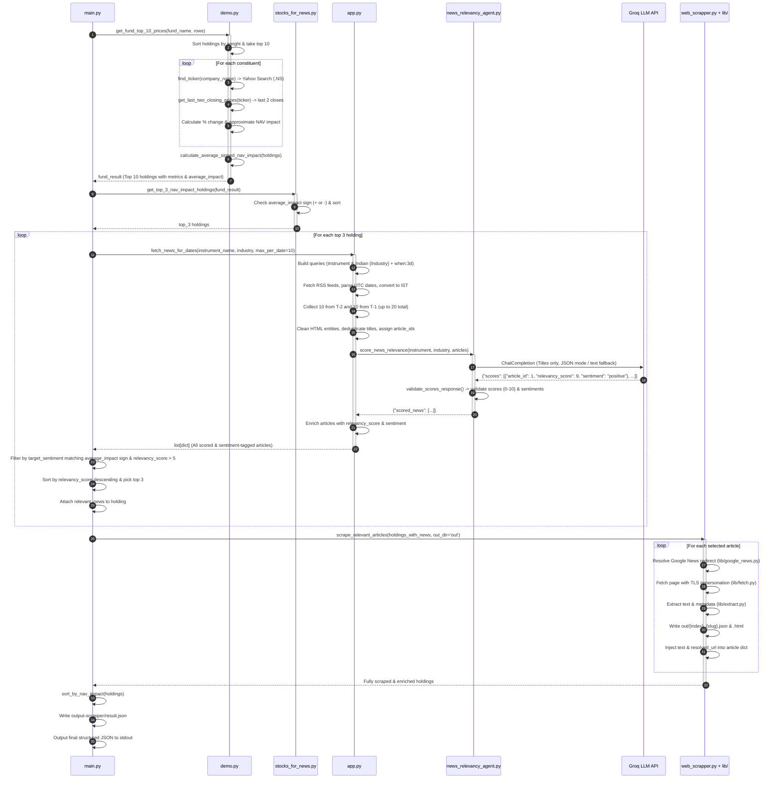

# Portfolio Intelligence, Sentiment & News Scraping Analysis System

A comprehensive technical reference, architectural specification, and operational documentation for the **Portfolio Intelligence, Sentiment & News Scraping Analysis System**.

---

## 1. Executive Summary & System Overview

The **Portfolio Intelligence, Sentiment & News Scraping Analysis System** is an automated financial analytics and intelligence pipeline tailored for Indian mutual funds and equity portfolios.

Given raw fund portfolio constituent data (company names, sector/industry classifications, and percentage weights), the system executes an end-to-end multi-stage pipeline:
1. **Dynamic Ticker Resolution**: Resolves real-time National Stock Exchange of India (**NSE**) ticker symbols dynamically via Yahoo Finance search queries without maintaining hardcoded lookup dictionaries.
2. **Historical Price Extraction**: Extracts recent trading session closing prices using historical market data, automatically skipping weekends and NSE trading holidays.
3. **Attribution & Directional Analysis**: Computes each holding's price change, approximate contribution to the fund's Net Asset Value (**NAV Impact**), and the portfolio's net directional trend (**Average Signed NAV Impact**).
4. **Directional Mover Isolation**: Isolates the **Top 3 directional movers** (the strongest positive drivers during bullish sessions or the greatest negative drags during bearish sessions).
5. **Date-Bounded News Harvesting**: Harvests real-time Google News RSS feeds for both the specific company instrument and its broader industry sector in Indian Standard Time (**IST**), collecting up to **10 articles from 2 days ago ($T-2$)** and up to **10 articles from 1 day ago ($T-1$)** (up to 20 total articles per holding).
6. **Title-Only LLM Relevance & Sentiment Scoring**: Evaluates article headlines using a specialized **Groq LLM Relevance & Sentiment Agent** (`openai/gpt-oss-120b` or custom configured model) to independently determine:
   - **`relevancy_score` (0–10)**: Financial materiality and expected impact on stock performance.
   - **`sentiment` (`"positive"` or `"negative"`)**: Directional stock price movement expectation based strictly on the headline.
7. **Directional Sentiment-Aligned Filtering**: Matches the news sentiment to the fund's net trend:
   - If the fund experienced a **negative average NAV impact**, selects the **top 3 news articles with `negative` sentiment** and `relevancy_score > 5`.
   - If the fund experienced a **positive average NAV impact**, selects the **top 3 news articles with `positive` sentiment** and `relevancy_score > 5`.
8. **Automated Article Scraping & Publisher Resolution**:
   - Uses the built-in scraping engine ([`web_scrapper.py`](file:///c:/Users/geete/Downloads/fetching-data-from-url/web_scrapper.py) and [`lib/`](file:///c:/Users/geete/Downloads/fetching-data-from-url/lib)) to resolve Google News obfuscated tracking links to their original canonical publisher URLs via Google's internal `batchexecute` protocol.
   - Bypasses anti-bot mechanisms using TLS browser fingerprint impersonation (`curl_cffi`).
   - Extracts clean article text, metadata, and HTML via `trafilatura` and `BeautifulSoup4`/`lxml`.
   - Injects the extracted text into the `"text"` attribute of each article in the JSON.
9. **Multi-Tier File & Storage Persistence**:
   - Saves individual scraped JSON (`{index}_{slug}.json`) and raw HTML (`{index}_{slug}.html`) files into the [`out/`](file:///c:/Users/geete/Downloads/fetching-data-from-url/out) folder.
   - Saves the entire enriched final portfolio intelligence JSON into [`output-scrapper/result.json`](file:///c:/Users/geete/Downloads/fetching-data-from-url/output-scrapper/result.json).
10. **Structured Output**: Emits the clean, sorted JSON payload with full article text to stdout.

---

## 2. High-Level System Architecture

```mermaid
flowchart TD
    subgraph S1["1. Market Data & NAV Attribution Engine (demo.py & stocks_for_news.py)"]
        A[Fund Portfolio Data\nName, Industry, % Weight] --> B[get_top_10_holdings\nSort by NAV % descending]
        B --> C[find_ticker\nYahoo Search .NS Suffix]
        C --> D[get_last_two_closing_prices\nTicker.history 10d -> last 2 closes]
        D --> E[calculate_approx_nav_impact\nWeight * Change % / 100]
        E --> F[calculate_average_signed_nav_impact\nMean of top 10 impacts]
        F --> G[get_top_3_nav_impact_holdings\nFilter by Directional Trend]
    end

    subgraph S2["2. News Harvesting & IST Date Engine (app.py)"]
        G --> H[fetch_news_for_dates\n10 from T-2, 10 from T-1 = 20 total]
        H --> I[Build RSS URLs\nInstrument & Indian + Industry + when:3d]
        I --> J[Fetch Google News RSS\nfeedparser parse]
        J --> K[Date Normalization (IST)\nUTC struct_time -> IST datetime]
        K --> L[Target Date Filtering & Grouping\nUp to 10 articles for T-2 and 10 for T-1]
        L --> M[Sanitize Text & Deduplicate\nStrip HTML, decode entities, unique titles]
    end

    subgraph S3["3. Relevance & Sentiment Scoring Agent (news_relevancy_agent.py)"]
        M --> N[score_news_relevance\nSend title-only payload to Groq]
        N --> O[Groq LLM API\nopenai/gpt-oss-120b\ntemp=0.1, max_tokens=3000]
        O --> P[validate_scores_response\nValidate IDs, ranges 0-10, sentiment positive/negative]
        P --> Q[Enrich Original Articles\nAttach relevancy_score and sentiment]
    end

    subgraph S4["4. Directional Filtering & Web Scraping Engine (main.py, web_scrapper.py & lib/)"]
        Q --> R{Check average_signed_nav_impact}
        R -- "Negative (< 0)" --> S1[Filter sentiment == 'negative' & score > 5\nSort relevancy_score desc -> Top 3]
        R -- "Positive (> 0)" --> S2[Filter sentiment == 'positive' & score > 5\nSort relevancy_score desc -> Top 3]
        S1 --> T[Attach to Holding Object]
        S2 --> T
        T --> U[scrape_relevant_articles\nFor each link: resolve redirect, fetch page & extract text]
        U --> V[Save scraped .json & .html files to out/ folder]
        V --> W[Attach 'text' & 'resolved_url' attributes to article JSON]
        W --> X[sort_by_nav_impact\nNegatives asc | Positives desc]
    end

    subgraph S5["5. Persistence & Output Delivery"]
        X --> Y[Save complete JSON to output-scrapper/result.json]
        Y --> Z[Emit Formatted JSON to stdout]
    end
```

---

## 3. End-to-End Pipeline Execution Flow



---

## 4. Mathematical & Financial Formulations

### 4.1 Stock Price Percentage Change ($\Delta P$)
For an equity ticker between the two most recent valid trading sessions ($t-2$ and $t-1$):

$$\Delta P = \left( \frac{P_{t-1} - P_{t-2}}{P_{t-2}} \right) \times 100$$

*Where:*
- $P_{t-1}$ is the closing price of the most recent trading session.
- $P_{t-2}$ is the closing price of the preceding trading session.

### 4.2 Holding NAV Impact Percentage
The approximate contribution of holding $i$ to the fund's total NAV percentage change:

$$\text{NAV Impact (\%)} = \frac{W_i \times \Delta P_i}{100}$$

*Where:*
- $W_i$ is the weight of holding $i$ as a percentage of total portfolio NAV (e.g., $9.31\%$).
- $\Delta P_i$ is the percentage price change of holding $i$ (e.g., $+0.98\%$).
- $\text{NAV Impact} = \frac{9.31 \times 0.98}{100} = +0.091\%$.

### 4.3 Average Signed NAV Impact ($\overline{\text{Impact}}$)
To evaluate the overall portfolio directional bias across top constituents:

$$\overline{\text{Impact}} = \frac{1}{N} \sum_{i=1}^{N} \text{NAV Impact}_i$$

*Where $N$ is the number of evaluated top holdings (typically $N=10$).*

### 4.4 Directional Holding & News Selection Matrix
- **Negative Portfolio Session ($\overline{\text{Impact}} < 0$):**
  - **Holdings**: Isolates the top 3 holdings with negative NAV impact, sorted ascending (most severe drag first).
  - **News**: Filters news articles where `sentiment == "negative"` and `relevancy_score > 5`, sorted by `relevancy_score` descending, taking up to top 3 articles per holding.
- **Positive Portfolio Session ($\overline{\text{Impact}} > 0$):**
  - **Holdings**: Isolates the top 3 holdings with positive NAV impact, sorted descending (highest positive contributor first).
  - **News**: Filters news articles where `sentiment == "positive"` and `relevancy_score > 5`, sorted by `relevancy_score` descending, taking up to top 3 articles per holding.
- **Neutral Session ($\overline{\text{Impact}} == 0$):**
  - Returns `[]` (no clear directional bias).

---

## 5. Detailed Component Breakdown

### 5.1 `main.py` — Orchestrator & CLI Entry Point
Coordinates market data calculation, news harvesting, sentiment alignment, full article scraping, and multi-tier output writing.

- **`main()`**:
  - Ingests raw fund constituent rows (name, sector/industry, percentage weight).
  - Suppresses third-party console noise during `demo.get_fund_top_10_prices` using `contextlib.redirect_stdout`.
  - Dispatches top 3 directional holdings to `process_holdings(top_3, average_impact)`.
  - Calls `scrape_relevant_articles(holdings_with_news, OUT_DIR)` to fetch and inject full article body text.
  - Sorts holdings with `sort_by_nav_impact`.
  - Saves the entire payload into `output-scrapper/result.json`.
  - Emits the clean JSON payload to stdout.
- **`fetch_and_score_news(holding: dict, target_sentiment: str, min_relevancy_score: int = 5) -> list[dict]`**:
  - Calls `app.fetch_news_for_dates(instrument_name, industry, max_per_date=10)`.
  - Filters articles matching `target_sentiment` with `relevancy_score > min_relevancy_score`.
  - Sorts matching articles by `relevancy_score` descending (with publication timestamp tie-breaker).
  - Returns the top 3 articles.
- **`scrape_relevant_articles(holdings: list[dict], out_dir: Path = OUT_DIR) -> list[dict]`**:
  - Iterates through each holding's `relevant_news` items.
  - Calls `scrape_one(session, link)` to resolve Google News redirects and extract full page text.
  - Injects `article["text"]` and `article["resolved_url"]`.
  - Saves `{index}_{slug}.json` and `{index}_{slug}.html` to the `out/` folder.

---

### 5.2 `demo.py` — Ticker Discovery, Price Engine & NAV Attribution
- **`find_ticker(company_name: str) -> Optional[str]`**:
  - Dynamically searches Yahoo Finance (`yfinance.Search(company_name).quotes`) and retrieves the first symbol ending with `.NS` (National Stock Exchange of India).
- **`get_last_two_closing_prices(ticker: str) -> Optional[list[dict]]`**:
  - Queries `yf.Ticker(ticker).history(period="10d", interval="1d", auto_adjust=False)`.
  - Drops rows with missing values, strips timezone metadata with `.tz_localize(None)`, and extracts the last 2 valid trading sessions.
- **`get_top_10_holdings(rows: list[dict]) -> list[dict]`**:
  - Parses percentage strings (`"9.31%"` $\rightarrow 9.31$) and extracts the top 10 weighted holdings.
- **`calculate_approx_nav_impact(nav_percentage, change_percentage) -> float`**:
  - Computes $(W_i \times \Delta P_i) / 100$.
- **`calculate_average_signed_nav_impact(holdings: list[dict]) -> float`**:
  - Computes the mean signed NAV impact across all top holdings.

---

### 5.3 `stocks_for_news.py` — Directional Holding Filter
- **`get_top_3_nav_impact_holdings(fund_result: dict) -> list[dict]`**:
  - If `average_signed_nav_impact < 0`: filters `nav_impact_percentage < 0`, sorts ascending, returns `[:3]`.
  - If `average_signed_nav_impact > 0`: filters `nav_impact_percentage > 0`, sorts descending, returns `[:3]`.
  - If `average_signed_nav_impact == 0`: returns `[]`.

---

### 5.4 `app.py` — Google News RSS Harvester & IST Date Engine
- **`build_news_url_with_date(query: str, days_back: int = 3) -> str`**:
  - Generates date-constrained RSS search URLs: `{query} when:{days_back}d`.
- **`_parse_feedparser_date(published_parsed) -> Optional[datetime]`**:
  - Converts `feedparser` UTC `struct_time` into timezone-aware IST (`UTC+05:30`).
- **`_clean_html_text(text: str) -> str`**:
  - Strips HTML tags, unescapes entities, and normalizes whitespace.
- **`fetch_news_for_dates(instrument_name, industry, max_per_date=10) -> list[dict]`**:
  - Identifies target dates $T-2$ (2 days ago) and $T-1$ (1 day ago) in IST.
  - Queries both company instrument and Indian industry feeds.
  - Retains articles matching $T-2$ and $T-1$, capped at 10 articles per date (up to 20 total per holding).
  - Deduplicates by headline and submits titles to `news_relevancy_agent.score_news_relevance`.
  - Enriches articles with `relevancy_score` and `sentiment`.

---

### 5.5 `news_relevancy_agent.py` — Groq LLM Relevance & Sentiment Evaluator
- **Model Configuration**:
  - Model: `openai/gpt-oss-120b` (configurable via `GROQ_MODEL`).
  - Temperature: `0.1` (deterministic output).
  - Max Tokens: `3000`.
- **Title-Only Optimization**:
  - Evaluates only `[{"article_id": int, "title": str}]` to minimize token latency and focus purely on headline signals.
- **Scoring & Sentiment Criteria**:
  - `relevancy_score` (0–10 scale).
  - `sentiment` (`"negative"` if headline implies stock price drops; `"positive"` if headline implies stock price rises).
- **Resilient Fallback Engine**:
  - Requests JSON object mode first.
  - Uses `extract_json_from_text` (regex markdown and outermost JSON boundaries) as an automatic fallback if strict validation fails.
  - `validate_scores_response`: Validates article IDs, checks $[0, 10]$ boundaries, and normalizes sentiment strings.

---

### 5.6 `web_scrapper.py` & `lib/` Package — Anti-Bot Scraping Engine
- **[`web_scrapper.py`](file:///c:/Users/geete/Downloads/fetching-data-from-url/web_scrapper.py)**:
  - Main CLI interface supporting direct URLs, `--file`, `--rss`, and `--preset india`.
  - Exposes `scrape_one(session, url)` and `_write_record(out_dir, index, record)` for direct programmatic import.
- **[`lib/google_news.py`](file:///c:/Users/geete/Downloads/fetching-data-from-url/lib/google_news.py)**:
  - Detects Google News wrappers (`/articles/` or `/read/`).
  - Fetches the wrapper page, extracts signature (`data-n-a-sg`) and timestamp (`data-n-a-ts`), and queries Google's internal `DotsSplashUi/data/batchexecute` endpoint.
  - Unpacks the `garturlres` envelope to retrieve the true canonical publisher URL.
- **[`lib/fetch.py`](file:///c:/Users/geete/Downloads/fetching-data-from-url/lib/fetch.py)**:
  - Uses `curl_cffi` to match authentic browser TLS fingerprints (JA3/JA4) and HTTP/2 handshakes.
  - Rotates browser fingerprints on retry (`safari`, `firefox135`, `chrome131`).
  - Handles automatic retries with exponential backoff on transient HTTP status codes.
- **[`lib/extract.py`](file:///c:/Users/geete/Downloads/fetching-data-from-url/lib/extract.py)**:
  - Uses `trafilatura` for primary content extraction.
  - If extracted text is thin (`< 120` chars), applies `BeautifulSoup4` with `lxml` to extract OpenGraph meta tags (`og:title`, `og:description`, `og:image`) and `<article>` body text.

---

## 6. Data Contracts & Schemas

### 6.1 Input Holding Row Schema
```json
{
  "name": "HDFC Bank Ltd",
  "detail": "Financial Services",
  "percentage": "9.31%"
}
```

### 6.2 Intermediate Scored Article Schema (app.py)
```json
{
  "title": "HDFC Bank Shares Flat Following MCLR Rate Cut",
  "description": "HDFC Bank Shares Flat Following MCLR Rate Cut Whalesbook",
  "link": "https://news.google.com/rss/articles/CBMiww...",
  "source": "Whalesbook",
  "published": "2026-09-08T11:13:24+05:30",
  "date": "2026-09-08",
  "relevancy_score": 8,
  "sentiment": "positive"
}
```

### 6.3 Final Structured JSON Output Schema (`output-scrapper/result.json`)
```json
[
  {
    "name": "HDFC Bank Ltd",
    "industry": "Financial Services",
    "nav_percentage": 9.31,
    "ticker": "HDFCBANK.NS",
    "change_percentage": 0.98,
    "nav_impact_percentage": 0.091,
    "relevant_news": [
      {
        "title": "HDFC Bank Shares Flat Following MCLR Rate Cut",
        "description": "HDFC Bank Shares Flat Following MCLR Rate Cut Whalesbook",
        "link": "https://news.google.com/rss/articles/CBMiww...",
        "source": "Whalesbook",
        "published": "2026-09-08T11:13:24+05:30",
        "date": "2026-09-08",
        "relevancy_score": 8,
        "sentiment": "positive",
        "text": "HDFC Bank shares traded flat on Tuesday as the lender reduced its MCLR by 5–10 basis points. The bank is simultaneously scaling its gold loan portfolio while approaching a key leadership transition scheduled for late October 2026...",
        "resolved_url": "https://www.whalesbook.com/news/English/bankingfinance/HDFC-Bank-Shares-Flat-Following-MCLR-Rate-Cut/6a9fa07ca6e2348f2a63e440"
      }
    ]
  }
]
```

---

## 7. Storage Structure & Output Artifacts

| Directory / File | Description |
| :--- | :--- |
| [`out/*.json`](file:///c:/Users/geete/Downloads/fetching-data-from-url/out) | Individual JSON records containing structured article metadata, authors, images, and full text for each scraped article. |
| [`out/*.html`](file:///c:/Users/geete/Downloads/fetching-data-from-url/out) | Raw HTML snapshots of the scraped publisher pages for auditing and offline inspection. |
| [`output-scrapper/result.json`](file:///c:/Users/geete/Downloads/fetching-data-from-url/output-scrapper/result.json) | The unified, complete portfolio intelligence output containing all top holdings, calculated financial metrics, and full scraped articles. |

---

## 8. Dependencies & Environment Configuration

### 8.1 Python Dependencies (`requirements.txt`)
```text
requests>=2.31.0
groq>=0.11.0
langchain-groq>=0.2.0
langchain-core>=0.3.0
pydantic>=2.0.0
python-dotenv
feedparser>=6.0.0
curl_cffi>=0.7.0
trafilatura>=1.12.0
beautifulsoup4>=4.12.0
lxml>=5.0.0
yfinance>=0.2.30
```

### 8.2 Environment Variables (`.env`)
```ini
GROQ_API_KEY=gsk_your_groq_api_key_here
GROQ_MODEL=openai/gpt-oss-120b
```

---

## 9. Setup & Execution Guide

### 9.1 Installation
```bash
# Install all required Python packages
pip install -r requirements.txt
```

### 9.2 Running the Full Pipeline
```bash
# Execute end-to-end portfolio attribution, news harvesting, sentiment scoring, and full scraping
python main.py
```

### 9.3 Running Standalone Components
```bash
# 1. Run interactive instrument news lookup:
python app.py

# 2. Run standalone Yahoo Finance NAV price tests:
python demo.py

# 3. Run standalone web scraper on Indian market feeds:
python web_scrapper.py --preset india --limit 5
```
