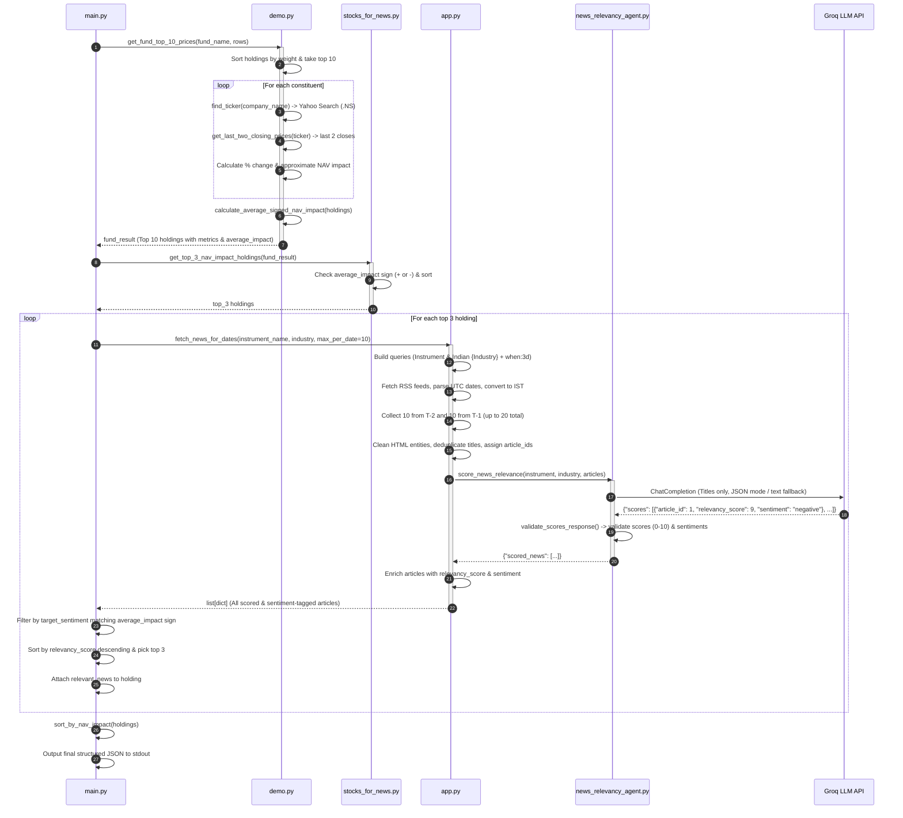

# Portfolio Intelligence, Sentiment & News Relevance Analysis System

A comprehensive technical reference, architectural guide, and operational documentation for the **Portfolio Intelligence, Sentiment & News Relevance Analysis System**.

---

## 1. Executive Summary & System Overview

The **Portfolio Intelligence, Sentiment & News Relevance Analysis System** is an automated financial analytics and intelligence pipeline tailored for Indian mutual funds and equity portfolios.

Given raw fund portfolio constituent data (company names, sector/industry classifications, and percentage weights), the system:
1. **Dynamic Ticker Resolution**: Resolves real-time National Stock Exchange of India (**NSE**) ticker symbols dynamically via Yahoo Finance search queries without hardcoded mapping dictionaries.
2. **Historical Price Extraction**: Extracts recent trading session closing prices using historical market data, automatically skipping weekends and NSE holidays.
3. **Attribution & Directional Analysis**: Computes each holding's price change, approximate contribution to the fund's Net Asset Value (**NAV Impact**), and the portfolio's net directional trend (**Average Signed NAV Impact**).
4. **Directional Mover Isolation**: Isolates the **Top 3 directional movers** (the strongest positive drivers during bullish sessions or the greatest negative drags during bearish sessions).
5. **Multi-Day News Harvesting**: Harvests real-time Google News RSS feeds for both the specific company instrument and its broader industry sector in Indian Standard Time (**IST**), collecting up to **10 articles from 2 days ago ($T-2$)** and up to **10 articles from 1 day ago ($T-1$)** (up to 20 total articles per holding).
6. **Title-Only LLM Relevance & Sentiment Scoring**: Evaluates article headlines using a specialized **Groq LLM Relevance & Sentiment Agent** (`openai/gpt-oss-120b` or custom configured model) to independently determine:
   - **`relevancy_score` (0–10)**: Financial materiality and expected impact on stock performance.
   - **`sentiment` (`"positive"` or `"negative"`)**: Directional stock movement expectation based on the headline.
7. **Directional Sentiment-Aligned News Filtering**: Matches the news sentiment to the fund's net trend:
   - If the fund experienced a **negative average NAV impact**, selects the **top 3 news articles with `negative` sentiment** and `relevancy_score > 5`.
   - If the fund experienced a **positive average NAV impact**, selects the **top 3 news articles with `positive` sentiment** and `relevancy_score > 5`.
8. **Full Article Content Scraping & Out Folder Persistence**:
   - Integrates [`web_scrapper.py`](file:///c:/Users/geete/Downloads/fetching-data-from-url/web_scrapper.py) into [`main.py`](file:///c:/Users/geete/Downloads/fetching-data-from-url/main.py) via `scrape_relevant_articles`.
   - Resolves Google News redirects, bypasses anti-bot controls using TLS browser impersonation, and scrapes clean article text.
   - Saves individual scraped JSON & raw HTML files to [`out/`](file:///c:/Users/geete/Downloads/fetching-data-from-url/out).
   - Injects the extracted text into the `"text"` attribute of each article.
9. **Full Result JSON Persistence in `output-scrapper/`**:
   - Automatically creates the [`output-scrapper/`](file:///c:/Users/geete/Downloads/fetching-data-from-url/output-scrapper) folder.
   - Saves the entire enriched final portfolio intelligence JSON into [`output-scrapper/result.json`](file:///c:/Users/geete/Downloads/fetching-data-from-url/output-scrapper/result.json).
10. **Structured Output**: Emits the clean, sorted JSON payload with full article text to stdout.

---

## 2. High-Level System Architecture

```mermaid
flowchart TD
    subgraph Ingestion_and_Math["1. Market Data & NAV Attribution Engine (demo.py & stocks_for_news.py)"]
        A[Fund Portfolio Data\nName, Industry, % Weight] --> B[get_top_10_holdings\nSort by NAV % descending]
        B --> C[find_ticker\nYahoo Search .NS Suffix]
        C --> D[get_last_two_closing_prices\nTicker.history 10d -> last 2 closes]
        D --> E[calculate_approx_nav_impact\nWeight * Change % / 100]
        E --> F[calculate_average_signed_nav_impact\nMean of top 10 impacts]
        F --> G[get_top_3_nav_impact_holdings\nFilter by Directional Trend]
    end

    subgraph News_Harvesting["2. News Harvesting & IST Engine (app.py)"]
        G --> H[fetch_news_for_dates\n10 from T-2, 10 from T-1 = 20 total]
        H --> I[Build RSS URLs\nInstrument & Indian + Industry + when:3d]
        I --> J[Fetch Google News RSS\nfeedparser parse]
        J --> K[Date Normalization (IST)\nUTC struct_time -> IST datetime]
        K --> L[Target Date Filtering & Grouping\nUp to 10 articles for T-2 and 10 for T-1]
        L --> M[Sanitize Text & Deduplicate\nStrip HTML, decode entities, unique titles]
    end

    subgraph LLM_Scoring["3. Relevance & Sentiment Agent (news_relevancy_agent.py)"]
        M --> N[score_news_relevance\nSend title-only payload to Groq]
        N --> O[Groq LLM API\nopenai/gpt-oss-120b\ntemp=0.1, max_tokens=3000]
        O --> P[validate_scores_response\nValidate IDs, ranges 0-10, sentiment positive/negative]
        P --> Q[Enrich Original Articles\nAttach relevancy_score and sentiment]
    end

    subgraph Aggregation_and_Output["4. Directional Filtering, Web Scraping & Storage (main.py)"]
        Q --> R{Check average_signed_nav_impact}
        R -- "Negative (< 0)" --> S1[Filter sentiment == 'negative' & score > 5\nSort relevancy_score desc -> Top 3]
        R -- "Positive (> 0)" --> S2[Filter sentiment == 'positive' & score > 5\nSort relevancy_score desc -> Top 3]
        S1 --> T[Attach to Holding Object]
        S2 --> T
        T --> U[scrape_relevant_articles\nResolve Google News URLs & Scrape Full Text via web_scrapper]
        U --> V[Save scraped .json & .html files to out/ folder]
        V --> W[Attach 'text' attribute to article JSON]
        W --> X[sort_by_nav_impact\nNegatives asc | Positives desc]
        X --> Y[Save complete JSON to output-scrapper/result.json]
        Y --> Z[Final Structured JSON Output to stdout]
    end
```

---

## 3. End-to-End Pipeline Execution Flow



---

## 4. Mathematical & Financial Formulations

### 4.1 Stock Price Percentage Change ($\Delta P$)
For an equity ticker between the two most recent valid trading sessions ($t-2$ and $t-1$):

$$\Delta P = \left( \frac{P_{t-1} - P_{t-2}}{P_{t-2}} \right) \times 100$$

*Where:*
- $P_{t-1}$ is the closing price of the most recent trading session.
- $P_{t-2}$ is the closing price of the preceding trading session.

### 4.2 Holding NAV Impact Percentage
The approximate contribution of holding $i$ to the fund's NAV change:

$$\text{NAV Impact (\%)} = \frac{W_i \times \Delta P_i}{100}$$

*Where:*
- $W_i$ is the weight of holding $i$ as a percentage of total portfolio NAV.
- $\Delta P_i$ is the percentage price change of holding $i$.

### 4.3 Average Signed NAV Impact ($\overline{\text{Impact}}$)
To evaluate the overall portfolio directional bias:

$$\overline{\text{Impact}} = \frac{1}{N} \sum_{i=1}^{N} \text{NAV Impact}_i$$

*Where $N$ is the number of top holdings (typically $N=10$).*

### 4.4 Directional Holding & News Selection
- **Negative Session ($\overline{\text{Impact}} < 0$):**
  - **Holdings**: Isolates the top 3 holdings with negative NAV impact, sorted ascending (worst drag first).
  - **News**: Filters news articles where `sentiment == "negative"` and `relevancy_score > 5` (threshold above 5), sorted by `relevancy_score` descending, taking up to top 3.
- **Positive Session ($\overline{\text{Impact}} > 0$):**
  - **Holdings**: Isolates the top 3 holdings with positive NAV impact, sorted descending (greatest gainer first).
  - **News**: Filters news articles where `sentiment == "positive"` and `relevancy_score > 5` (threshold above 5), sorted by `relevancy_score` descending, taking up to top 3.
- **Neutral Session ($\overline{\text{Impact}} == 0$):**
  - Returns `[]` (no clear directional bias).

---

## 5. Detailed Component & Module Breakdown

### 5.1 `main.py` — Orchestrator & CLI Entry Point
The primary execution script coordinating market data, news harvesting, sentiment alignment, and JSON output formatting.

- **`main()`**:
  - Ingests fund holdings (name, sector, percentage weight).
  - Suppresses stdout during `demo.get_fund_top_10_prices` via `contextlib.redirect_stdout`.
  - Determines `average_signed_nav_impact`.
  - Dispatches top 3 directional holdings to `process_holdings(top_3, average_impact)`.
  - Sorts holdings with `sort_by_nav_impact`.
  - Emits the final clean JSON to stdout.
- **`fetch_and_score_news(holding: dict, target_sentiment: str) -> list[dict]`**:
  - Calls `app.fetch_news_for_dates(instrument_name, industry, max_per_date=10)`.
  - Filters articles matching `target_sentiment` (`"negative"` or `"positive"`).
  - Sorts matching articles by `relevancy_score` descending (with publication timestamp tie-breaker).
  - Returns the top 3 articles.
- **`process_holdings(holdings: list[dict], average_impact: float) -> list[dict]`**:
  - Sets `target_sentiment = "negative" if average_impact < 0 else "positive"`.
  - Enriches each holding with its top 3 sentiment-matched news items.
- **`sort_by_nav_impact(holdings: list[dict]) -> list[dict]`**:
  - Partitions holdings into negative and positive impacts; sorts negatives ascending (most severe first) and positives descending (highest gainers first).

---

### 5.2 `demo.py` — Dynamic Ticker Discovery, Price Engine & NAV Math
- **`find_ticker(company_name: str) -> Optional[str]`**:
  - Dynamically searches Yahoo Finance (`yfinance.Search(company_name).quotes`) and retrieves the first symbol ending with `.NS` (NSE India).
- **`get_last_two_closing_prices(ticker: str) -> Optional[list[dict]]`**:
  - Queries `yf.Ticker(ticker).history(period="10d", interval="1d", auto_adjust=False)`.
  - Drops rows with missing values and returns the last 2 valid trading sessions.
  - Strips timezone metadata with `.tz_localize(None)`.
- **`get_top_10_holdings(rows: list[dict]) -> list[dict]`**:
  - Parses percentage strings (`"9.31%"` $\rightarrow 9.31$) and extracts the top 10 weighted holdings.
- **`calculate_approx_nav_impact(nav_percentage, change_percentage) -> float`**:
  - Computes $(W_i \times \Delta P_i) / 100$.
- **`calculate_average_signed_nav_impact(holdings: list[dict]) -> float`**:
  - Computes the mean signed NAV impact across holdings.
- **`get_fund_top_10_prices(fund_name, rows)`**:
  - Runs the full pipeline for all top 10 constituents.

---

### 5.3 `stocks_for_news.py` — Directional Holding Filter
- **`get_top_3_nav_impact_holdings(fund_result: dict) -> list[dict]`**:
  - Inspects `average_signed_nav_impact`.
  - Negative: filters `nav_impact_percentage < 0`, sorts ascending, returns `[:3]`.
  - Positive: filters `nav_impact_percentage > 0`, sorts descending, returns `[:3]`.
  - Zero: returns `[]`.

---

### 5.4 `app.py` — Google News RSS Harvester & IST Date Engine
- **`build_news_url_with_date(query: str, days_back: int = 3) -> str`**:
  - Builds Google News RSS search URL with date constraints: `{query} when:{days_back}d`.
- **`_parse_feedparser_date(published_parsed) -> Optional[datetime]`**:
  - Parses UTC `struct_time` and converts it to IST (`timezone(timedelta(hours=5, minutes=30))`).
- **`_clean_html_text(text: str) -> str`**:
  - Strips HTML tags, unescapes HTML entities, and normalizes whitespace.
- **`fetch_news_for_dates(instrument_name, industry, max_per_date=10) -> list[dict]`**:
  - Calculates $T-2$ (2 days ago) and $T-1$ (1 day ago) in IST.
  - Queries both Instrument and Indian Industry RSS feeds.
  - Retains articles matching $T-2$ and $T-1$, capped at up to 10 articles per date (up to 20 total).
  - Deduplicates by headline.
  - Passes title-only payload to `news_relevancy_agent.score_news_relevance`.
  - Enriches articles with `relevancy_score` and `sentiment`.

---

### 5.5 `news_relevancy_agent.py` — Groq LLM Relevance & Sentiment Evaluator
- **Model Configuration**:
  - Model: `openai/gpt-oss-120b` (configurable via `GROQ_MODEL`).
  - Temperature: `0.1` (deterministic output).
  - Maximum Tokens: `3000`.
- **Title-Only Evaluation**:
  - Sends only `article_id` and `title` to the LLM to minimize token overhead and focus classification strictly on headline signal.
- **Prompt Criteria**:
  - `relevancy_score` (0–10 scale).
  - `sentiment` (`"negative"` if headline implies stock price drops; `"positive"` if headline implies stock price rises).
- **Resilient Fallback Engine**:
  - Tries strict `response_format={"type": "json_object"}` first.
  - If Groq JSON mode encounters validation errors, retries with standard completion and uses regex-based JSON extraction (`extract_json_from_text`).
  - `validate_scores_response`: Validates IDs, range constraints ($[0, 10]$), and normalizes sentiment strings to `"positive"` or `"negative"`.

---

### 5.6 `web_scrapper.py` — Dynamic Headless Browser Scraper
- **`scrape_page(url: str) -> str`**:
  - Uses Playwright headless Chromium with a 3000ms delay to extract fully hydrated JavaScript DOM content.

---

## 6. Data Contracts & Schemas

### 6.1 Input Holding Row Schema
```json
{
  "name": "HDFC Bank Ltd",
  "detail": "Financial Services",
  "percentage": "9.31%"
}
```

### 6.2 LLM Request Payload (Titles Only)
```text
Target Instrument: Reliance Industries Ltd
Industry: Energy

List of 20 news titles to evaluate:
[
  {
    "article_id": 1,
    "title": "Reliance Industries Slips 0.30% to Rs 1,309 on September 3 as Profit-Taking Offsets Record Q1 Earnings"
  },
  {
    "article_id": 2,
    "title": "Reliance Industries slides Wednesday, underperforms competitors"
  }
]

Evaluate all 20 articles. Return JSON with "scores" containing exactly 20 objects matching each article_id from 1 to 20.
```

### 6.3 LLM Response Schema
```json
{
  "scores": [
    {
      "article_id": 1,
      "relevancy_score": 7,
      "sentiment": "negative"
    },
    {
      "article_id": 2,
      "relevancy_score": 5,
      "sentiment": "negative"
    }
  ]
}
```

### 6.4 Final Structured JSON Output
```json
[
  {
    "name": "GE Vernova T&D India Ltd",
    "industry": "Industrials",
    "nav_percentage": 2.81,
    "ticker": "GVT&D.NS",
    "change_percentage": -3.89,
    "nav_impact_percentage": -0.109,
    "relevant_news": [
      {
        "title": "GE Vernova T&D India Share Price: Today’s 2.11% Decline",
        "description": "GE Vernova T&D India Share Price: Today’s 2.11% Decline Univest",
        "link": "https://news.google.com/rss/articles/CBMiiAFBVV95cUxPU0dERU84elRQNnJiUjkta2NCdjJQcWN6RmctUEVZVzdWV0R3dU5yeEZ3V3BUR3prNkNnSU9JOHlQWHp2all4clhRb0pWR3h0SmItVUpKeGF0c1ZkSXQzNnZFYmRlQlczZ2p5QWluYndhUERNV3JMMUwyMC1YWXlqY19Vb1hhMHlx?oc=5",
        "source": "Univest",
        "published": "2026-09-09T15:11:00+05:30",
        "date": "2026-09-09",
        "relevancy_score": 5,
        "sentiment": "negative"
      }
    ]
  },
  {
    "name": "ICICI Bank Ltd",
    "industry": "Financial Services",
    "nav_percentage": 8.19,
    "ticker": "ICICIBANK.NS",
    "change_percentage": -0.46,
    "nav_impact_percentage": -0.038,
    "relevant_news": [
      {
        "title": "ICICI Bank Share Price Falls: Technicals, Valuation View",
        "description": "ICICI Bank Share Price Falls: Technicals, Valuation View Univest",
        "link": "https://news.google.com/rss/articles/CBMidkFVX3lxTE9xM0JmcXNVZS1lTGJZdk15SUM2VmdOX1hBY1pGb2t4akN1STJDZ1NLLU1lQ2RUOHNsR09lMU9NVXAwTWNLdWw3c1JpRDc3bm1HdjBNaldhYWFiMWdPWGZpeGVFMVFLWVY3UHF2ZDBRczBIUmRPS0E?oc=5",
        "source": "Univest",
        "published": "2026-09-08T13:31:00+05:30",
        "date": "2026-09-08",
        "relevancy_score": 8,
        "sentiment": "negative"
      },
      {
        "title": "Top Gainers and Losers on September 8, 2026 at 12:00 PM: BEL Leads Gainers, ICICI Bank Tops Losers",
        "description": "Top Gainers and Losers on September 8, 2026 at 12:00 PM: BEL Leads Gainers, ICICI Bank Tops Losers HDFC Sky",
        "link": "https://news.google.com/rss/articles/CBMiggFBVV95cUxOZFNLUl9za2pqaVZKUm5oVE9VZ1R5ZnFWWEwyN1JUaG9wdW5uRjVfLWl0TVNyejFsU3B0WFpCWklQT3M2cGcxNzBBZEN5bVZxY3BkaFdjWThFQWN5LUg0MDg3N3JsUzRPZy02T0lnRzgxZWN6NmU2dUNsaE5FeTBubnd3?oc=5",
        "source": "HDFC Sky",
        "published": "2026-09-08T12:09:49+05:30",
        "date": "2026-09-08",
        "relevancy_score": 7,
        "sentiment": "negative"
      },
      {
        "title": "ICICI Bank slips Tuesday, underperforms competitors",
        "description": "ICICI Bank slips Tuesday, underperforms competitors MarketWatch",
        "link": "https://news.google.com/rss/articles/CBMiqgFBVV95cUxPUnJ5RmVjdzlIalR4V2lsYVhCM2ZrSnpxOWh1NmVZallqRUxMRkE3VGR0eHhWVUVEVFAxcVJKVjFLMVNjajMwd3ZYSERyTEZpS2tZeTVuNG1JUGpaRUtzRWpWOFphalFsWGU3c0hKM0k0cjhQemNaOHQ1OW9KLWRPLU1JLXdnUm84WHlzXzBrSTZqdF83MUZ4ejJOWDE5eGFHX0twakkwbnU3UQ?oc=5",
        "source": "MarketWatch",
        "published": "2026-09-08T16:02:00+05:30",
        "date": "2026-09-08",
        "relevancy_score": 7,
        "sentiment": "negative"
      }
    ]
  },
  {
    "name": "Reliance Industries Ltd",
    "industry": "Energy",
    "nav_percentage": 4.2,
    "ticker": "RELIANCE.NS",
    "change_percentage": -0.44,
    "nav_impact_percentage": -0.018,
    "relevant_news": [
      {
        "title": "Reliance Industries Slips 0.30% to Rs 1,309 on September 3 as Profit-Taking Offsets Record Q1 Earnings",
        "description": "Reliance Industries Slips 0.30% to Rs 1,309 on September 3 as Profit-Taking Offsets Record Q1 Earnings The Eastern Herald",
        "link": "https://news.google.com/rss/articles/CBMigwFBVV95cUxPazdlX3NaaENCNUQ0aVlrRWVRQ0prdVRSdkt3UXdudkYtT3FLVlVBclIxa0k1ZFZzcjFxeEtVSm5XSGE3VE94TDJCeHIzYTFpX3Q4UzU4bkJ5ZlVQWUE5azJ5bC1nYkZienM5TDBuRHhoeWJhM0xjb1NjYzJPTE9WMVdmcw?oc=5",
        "source": "The Eastern Herald",
        "published": "2026-09-08T22:49:14+05:30",
        "date": "2026-09-08",
        "relevancy_score": 7,
        "sentiment": "negative"
      },
      {
        "title": "Reliance Industries slips Tuesday, underperforms competitors",
        "description": "Reliance Industries slips Tuesday, underperforms competitors MarketWatch",
        "link": "https://news.google.com/rss/articles/CBMizgFBVV95cUxQcFpIS0stSTNUekZGTHRkZXhrNjlUUFlEcENfMFh4UV9CQ1d3aXV3UU5BWkhSVjE4NVBEbmhjSU9rYS1JQ0NsUjktUENBOUFqU183cUlZTWU0NnMxZkN2RzZPV1ExTmowbWNzWk1vcGR3VElPd3FWNnBQS2otclBSUUlObEtLSWcxT0lLdHphR01WQzdELVRGM3VVMHVDSWZuYk50dWppSUxWNUpnS2dFN1dPamlmN2JKQmZRX1pSZERUWWNsbXNQN0hfM1Vldw?oc=5",
        "source": "MarketWatch",
        "published": "2026-09-08T16:00:00+05:30",
        "date": "2026-09-08",
        "relevancy_score": 5,
        "sentiment": "negative"
      },
      {
        "title": "Reliance Industries slides Wednesday, underperforms competitors",
        "description": "Reliance Industries slides Wednesday, underperforms competitors MarketWatch",
        "link": "https://news.google.com/rss/articles/CBMi0gFBVV95cUxPbXdyMzlpSGNuZWhmZmdsYUE0LVhfNW1EQ3ZQUlk5cUFtQmpibDRERjhva0I5MFQ5YThfdklMT2Fnemt3dTM0V21fUHF4RFIybzlaN19lbUVuRXhvcXd2Tnd6UXNGQ2ZnQWUwNzlHSmRwdWdBU3dQN3VncHJMUFVDc2lENFduZVZQcnVmUXZ5cEdzZGdlUW9vc2hCdEdHc3pPSndOdnJDOFh2elFxM01ldlpDMDJ6dG8tS1oxMVcxc2VuYWIxWnhLWGNKZl9sOTB0VkE?oc=5",
        "source": "MarketWatch",
        "published": "2026-09-09T16:00:00+05:30",
        "date": "2026-09-09",
        "relevancy_score": 5,
        "sentiment": "negative"
      }
    ]
  }
]
```

---

## 7. Setup & Execution Guide

### 7.1 Dependencies
```bash
pip install requests groq langchain-groq langchain-core pydantic python-dotenv feedparser yfinance playwright
playwright install chromium
```

### 7.2 Configuration (`.env`)
```ini
GROQ_API_KEY=gsk_your_groq_api_key_here
GROQ_MODEL=openai/gpt-oss-120b
```

### 7.3 Execution
```bash
# Execute end-to-end analysis
python main.py
```
